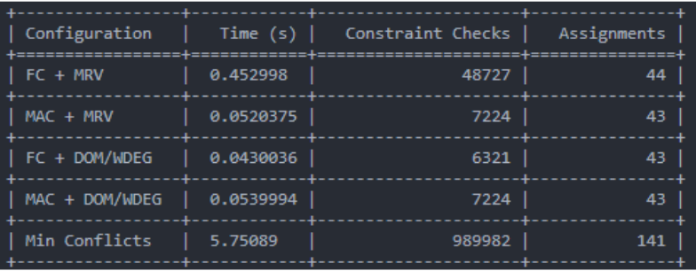
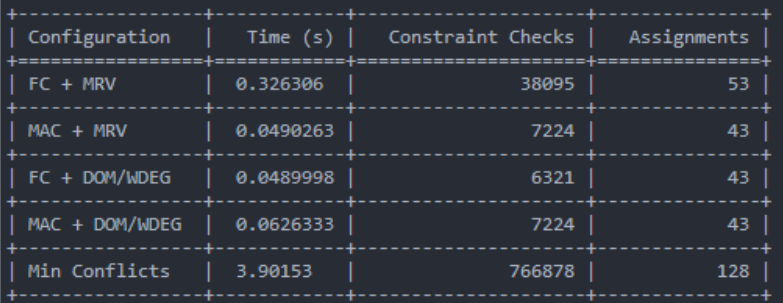
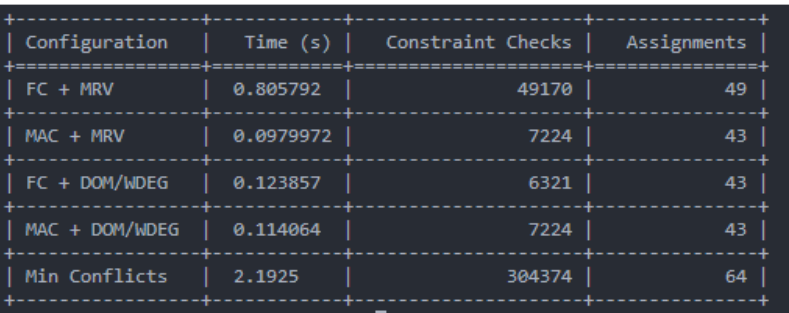

# 🧠 Exam Scheduling using CSP (Constraint Satisfaction Problem)

This university project solves the **Exam Timetabling Problem** using techniques from Artificial Intelligence and Constraint Satisfaction Problems (CSP). It supports various CSP strategies and heuristics to optimize scheduling based on course constraints such as semester overlap.

## 📂 Project Overview

The solution reads course data from a `.csv` file (written in Greek) and constructs a CSP model where:
- **Variables**: University courses
- **Domains**: Available time slots (combinations of days and hours)
- **Constraints**: 
  - Courses from the same semester cannot be scheduled on the same day
  - No two conflicting courses share the same slot

The program then applies CSP techniques such as:
- **Forward Checking (FC)**
- **Maintaining Arc Consistency (MAC)**
- **MRV (Minimum Remaining Values) heuristic**
- **DOM/WDEG (Domain over Weighted Degree) heuristic**

Performance is measured in terms of:
- Execution time
- Number of assignments
- Number of constraint checks

## 🛠️ Key Features

### 🔄 Heuristic & Algorithm Integration
- Added `csp.constraint_check_count` to track the number of constraint checks.
- DOM/WDEG heuristic is implemented via:
  - `update_weight(var1, var2, weight)`: Increases constraint weight on failure.
  - `domain_weight_ratio()`: Calculates ratio for variable selection.
  - `dom_wdeg()`: Chooses next variable based on smallest domain-to-weight ratio.

### 📁 Main Script: `exam_schedule.py`
Contains the entire scheduling logic and integrates all algorithms and heuristics.

#### Core Functions
- `read_courses(filename)`: Loads course data from the input `.csv` file.
- `create_exam_csp(courses)`: Builds the CSP model using courses and constraints.
- `solve_csp(csp, inference, select_unassigned_variable)`: Solves the CSP using different strategies and returns execution metrics.
- `print_solution(solution)`: Nicely formats and prints the final exam schedule.
- `__main__`: Runs the full process using multiple algorithm combinations and compares results in a tabular format.

## ▶️ How to Run

```bash
python exam_schedule.py
````

Make sure the required `courses.csv` file exists in the same directory or modify the path in `read_courses()`.
Also if you want to check the specific csv open with greek encoding! (Windows 1253)

## 📊 Example Output

```
Algorithm: FC + MRV
Execution Time: 0.03s
Assignments: 25
Constraint Checks: 148

Schedule:
Day 1, Slot 1: Calculus
Day 1, Slot 2: Data Structures
...
```

## 📚 Technologies & Tools

* Python 3.x
* Custom CSP framework (`csp.py`)
* CSV parsing
* Time measurement with `time` module

## 💡 Motivation

Exam scheduling was a classic real-world university projject of a CSP problem. This project was developed to experiment with different constraint solving strategies and evaluate their performance, especially under tight constraints (e.g., overlapping semesters).

## 🧪 Experimental Results & Analysis

To evaluate the performance of each CSP algorithm, we measured:

- **Number of assignments**: The minimum possible is 43 (each exam and its lab count as separate assignments).
- **Execution time**: Measured in seconds.
- **Constraint checks**: How many times constraints were evaluated during search.

### 📌 Test Cases

- **Example 1**: 21 days



- **Example 2**: 21 days



- **Example 3**: 17 days



### 📊 Observations

- **MAC + MRV** is the **most efficient strategy**, consistently achieving:
  - Fastest execution times
  - Minimal constraint checks
  - Always the minimum number of assignments (43)

- **FC + DOM/WDEG** performs significantly better than **FC + MRV**, both in execution time and constraint checks. It is the best-performing variant of forward checking.

- **DOM/WDEG** provides a clear benefit when combined with **Forward Checking**, but it does **not show improvement with MAC** (same number of constraint checks: 7224).

- **Min Conflicts** is the least efficient approach:
  - Highest number of assignments
  - Longest execution time
  - Poor scalability in constrained problems

## 📈 Performance Summary

The following table summarizes the average performance and observations across the test cases:

| Configuration     | Avg Time (s) | Avg Constraint Checks | Avg Assignments | Notes                                               |
|-------------------|--------------|------------------------|------------------|-----------------------------------------------------|
| **MAC + MRV**      | **0.0661**   | **7224**               | **43.0**         | 🔥 Fastest & most consistent across all test cases   |
| **FC + DOM/WDEG**  | 0.0713       | **6321**               | **43.0**         | ✅ Most efficient among Forward Checking approaches  |
| **MAC + DOM/WDEG** | 0.0768       | **7224**               | **43.0**         | Similar to MAC + MRV, no gain from DOM/WDEG         |
| FC + MRV           | 0.5284       | 45397.3                | 48.7             | ❌ Slower and more assignments than optimal          |
| Min Conflicts      | 3.9412       | 687411.3               | 111.0            | Worst performance: high time & excessive assignments|

## 📦 Reused Modules

This project also includes two support modules:

- **`search.py`**
- **`utils.py`**

These files are **included as-is** from the original CSP assignment materials (e.g., course book or online repository).  
**No modifications** were made to their content — they provide general-purpose search logic and utility functions that support CSP solving.

They are required for compatibility with the `csp.py` framework and backtracking search operations, but their behavior remains unchanged.
